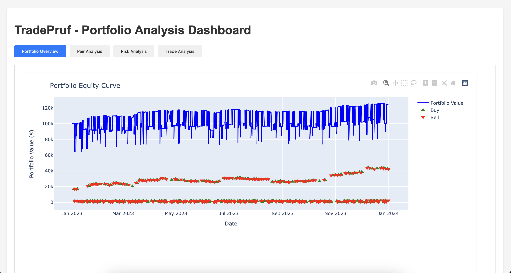
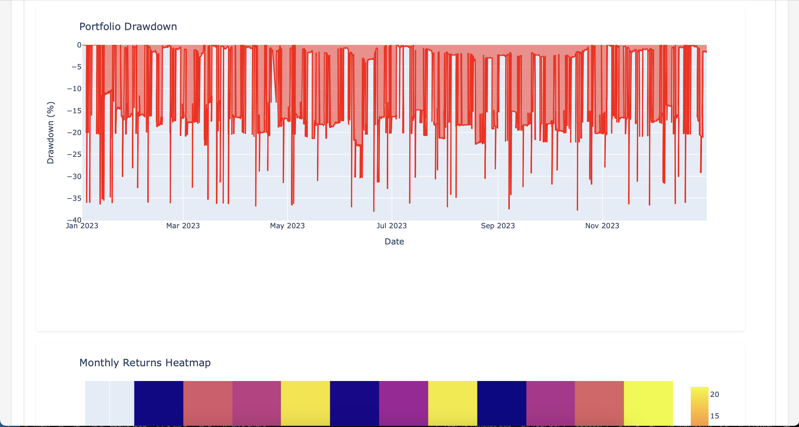
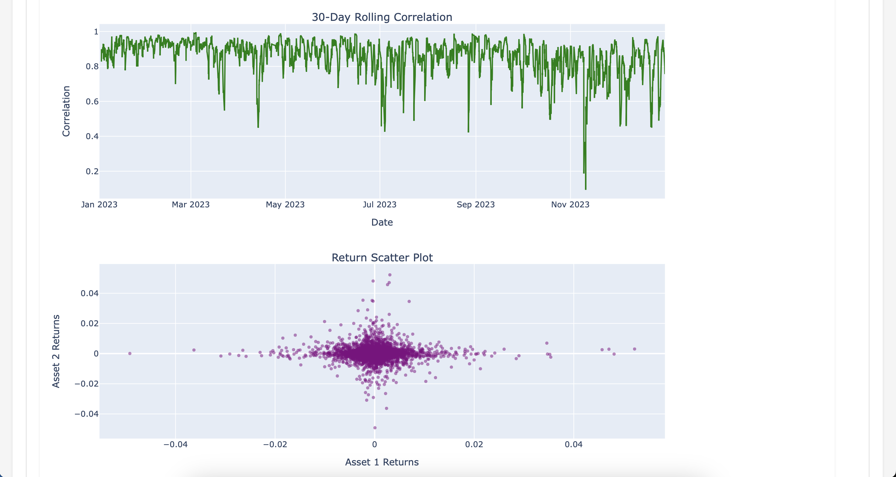
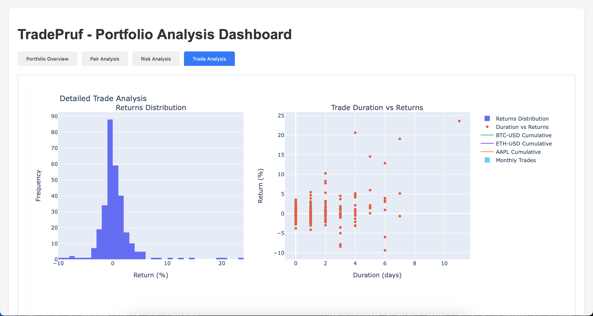

# TradePruf - Python Trading Backtester

## 🚀 Overview
TradePruf is a flexible and extensible backtesting framework that allows you to test trading strategies across multiple asset classes including stocks, cryptocurrencies, and ETFs. It provides detailed performance metrics, portfolio management capabilities, and interactive visualizations.

## 🚨 Disclaimer
This project was developed in a very short period with heavy use of AI assistance. While the code is functional and well-structured, it should be used for educational and research purposes only. Trading financial instruments involves substantial risk of loss. Past performance is not indicative of future results.

## ✨ Features
- Multiple asset classes support (Stocks, Crypto, ETFs)
- Built-in trading strategies:
  - Simple Moving Average (SMA) Crossover
  - Exponential Moving Average (EMA)
  - Relative Strength Index (RSI)
  - Moving Average Convergence Divergence (MACD)
  - Bollinger Bands
  - ATR Trailing Stop
- Portfolio backtesting with custom allocation
- Detailed performance metrics:
  - Total/Annual Returns
  - Sharpe Ratio
  - Maximum Drawdown
  - Win Rate
  - Trade Statistics
- Interactive visualizations:
  - Equity curves
  - Drawdown analysis
  - Monthly returns heatmap
  - Asset allocation
- Flexible data granularity (1m to 1wk)
- Position sizing and risk management
- Extensible strategy framework

## 🛠 Installation

1. Clone the repository:
```bash
git clone https://github.com/arman-bd/tradepruf.git
cd tradepruf
```

2. Create and activate a virtual environment using uv:
```bash
uv venv
source .venv/bin/activate  # On Windows: .venv\Scripts\activate
```

3. Install dependencies:
```bash
uv pip install -e ".[dev]"
```

## 📊 Quick Start

### Single Asset Backtest
```bash
# Basic backtest
tradepruf backtest --symbol BTC-USD --asset-type crypto --strategy sma

# With visualization
tradepruf backtest \
    --symbol AAPL \
    --asset-type stock \
    --strategy macd \
    --start-date 2023-01-01 \
    --end-date 2024-01-01 \
    --charts interactive
```

### Portfolio Backtest
1. Create a portfolio configuration file:
```json
{
    "initial_capital": 100000,
    "position_size": 0.1,
    "max_positions": 10,
    "start_date": "2023-01-01",
    "end_date": "2024-01-01",
    "interval": "1h",
    "assets": [
        {
            "symbol": "BTC-USD",
            "type": "crypto",
            "strategy": "sma",
            "params": {
                "short_window": 20,
                "long_window": 50
            }
        },
        {
            "symbol": "ETH-USD",
            "type": "crypto",
            "strategy": "rsi",
            "params": {
                "period": 14,
                "oversold": 30,
                "overbought": 70
            }
        },
        {
            "symbol": "AAPL",
            "type": "stock",
            "strategy": "macd"
        }
    ]
}
```

2. Run the backtest:
```bash
tradepruf backtest-portfolio --portfolio portfolios/btc-eth-aapl.json --charts interactive --enhanced-analysis
```

**Result**
```
     Portfolio Configuration     
┏━━━━━━━━━━━━━━━━━┳━━━━━━━━━━━━━┓
┃ Parameter       ┃       Value ┃
┡━━━━━━━━━━━━━━━━━╇━━━━━━━━━━━━━┩
│ Initial Capital │ $100,000.00 │
│ Position Size   │        0.20 │
│ Max Positions   │           5 │
│ Start Date      │  2023-01-01 │
│ End Date        │  2024-01-01 │
│ Interval        │          1h │
└─────────────────┴─────────────┘
                                      Assets                                      
┏━━━━━━━━━┳━━━━━━━━┳━━━━━━━━━━┳━━━━━━━━━━━━━━━━━━━━━━━━━━━━━━━━━━━━━━━━━━━━━━━━━━┓
┃ Symbol  ┃ Type   ┃ Strategy ┃ Extra Params                                     ┃
┡━━━━━━━━━╇━━━━━━━━╇━━━━━━━━━━╇━━━━━━━━━━━━━━━━━━━━━━━━━━━━━━━━━━━━━━━━━━━━━━━━━━┩
│ BTC-USD │ crypto │ sma      │ {"short_window": 20, "long_window": 50}          │
│ ETH-USD │ crypto │ rsi      │ {"period": 14, "oversold": 30, "overbought": 70} │
│ AAPL    │ stock  │ macd     │ "N/A"                                            │
└─────────┴────────┴──────────┴──────────────────────────────────────────────────┘
================================================================================
=== Starting portfolio backtest with 3 assets ===
================================================================================
Fetched 8676 bars for BTC-USD
Date range: 2023-01-01 00:00:00+00:00 to 2023-12-31 23:00:00+00:00
Fetched 8675 bars for ETH-USD
Date range: 2023-01-01 00:00:00+00:00 to 2023-12-31 23:00:00+00:00
Fetched 1742 bars for AAPL
Date range: 2023-01-03 09:30:00-05:00 to 2023-12-29 15:30:00-05:00
================================================================================
=== Generating signals ===
================================================================================
Generated SMA Crossover signals: Buy=111, Sell=110
Generated signals for BTC-USD using SMA Crossover
Generated RSI values: Min=2.86, Max=98.35
Generated RSI signals: Buy=117, Sell=116
Generated signals for ETH-USD using RSI Strategy
Generated MACD signals: Buy=71, Sell=71
Generated signals for AAPL using MACD Strategy

 Portfolio Backtest Results 
┏━━━━━━━━━━━━━━━┳━━━━━━━━━━┓
┃ Metric        ┃    Value ┃
┡━━━━━━━━━━━━━━━╇━━━━━━━━━━┩
│ Total Return  │   24.12% │
│ Annual Return │   24.20% │
│ Sharpe Ratio  │     0.12 │
│ Max Drawdown  │   38.12% │
│ Total Trades  │      299 │
│ Win Rate      │   47.83% │
│ Average Win   │  $443.41 │
│ Average Loss  │ $-253.45 │
│ Volatility    │  177.96% │
└───────────────┴──────────┘

                      Asset Performance Summary                      
┏━━━━━━━━━┳━━━━━━━━━━━━━━━┳━━━━━━━━┳━━━━━━━━┳━━━━━━━━━━━━┳━━━━━━━━━━┓
┃ Asset   ┃ Strategy      ┃ Type   ┃ Trades ┃        P&L ┃ Win Rate ┃
┡━━━━━━━━━╇━━━━━━━━━━━━━━━╇━━━━━━━━╇━━━━━━━━╇━━━━━━━━━━━━╇━━━━━━━━━━┩
│ BTC-USD │ SMA Crossover │ crypto │    111 │ $16,305.44 │    35.1% │
│ ETH-USD │ RSI Strategy  │ crypto │    117 │  $5,112.17 │    65.8% │
│ AAPL    │ MACD Strategy │ stock  │     71 │  $2,705.18 │    38.0% │
└─────────┴───────────────┴────────┴────────┴────────────┴──────────┘
```
&raquo; [View Event Journal](https://arman-bd.github.io/tradepruf/docs/sample_trade/backtest_btc-eth-aapl.txt)

**Analysis Dashboard**
Analysis Dashboard contains some interactive charts and tables to help you understand the performance of your portfolio. Here are some screenshots of the dashboard:

|  |  |
|:--:|:--:|
|  |  |

&raquo; [View Analysis Dashboard](https://arman-bd.github.io/tradepruf/docs/sample_trade/backtest_btc-eth-aapl.html)

## 📈 Custom Strategies
Create your own strategy by extending the base Strategy class:

```python
from strategies.base import Strategy, SignalType

class MyCustomStrategy(Strategy):
    def __init__(self, param1: int = 10, param2: float = 2.0):
        super().__init__("My Custom Strategy")
        self.param1 = param1
        self.param2 = param2
    
    def generate_signals(self, data: pd.DataFrame) -> pd.Series:
        signals = pd.Series(SignalType.HOLD, index=data.index)
        # Your strategy logic here
        return signals
```

## 📊 Visualization Options
- `interactive`: Display charts in browser
- `html`: Save interactive charts as HTML files
- `png`: Save static chart images
- `none`: No visualization (default)

## 🔍 Performance Metrics
- Total Return
- Annual Return
- Sharpe Ratio
- Maximum Drawdown
- Win Rate
- Average Win/Loss
- Total Trades
- Volatility
- Per-asset Performance

## 🛠 Development

### Running Tests
```bash
pytest tests/
```

### Code Style
```bash
# Format code
black .

# Lint
ruff check .

# Type checking
mypy src
```

## 📝 Todo
- [ ] Add more technical indicators
- [ ] Implement portfolio optimization
- [ ] Add transaction costs and slippage
- [ ] Real-time trading capabilities
- [ ] Enhanced risk management features
- [ ] Machine learning strategy support
- [ ] More visualization options
- [ ] Performance optimization for large datasets

## ⚠️ Limitations
- Limited to yfinance data
- No support for options or futures
- Basic position sizing
- No margin trading simulation
- Historical data limitations

## 📜 License
MIT License - see [LICENSE](LICENSE) for details

## 🤝 Contributing
Contributions are welcome! Please feel free to submit a Pull Request.

## 🙏 Acknowledgments
- YFinance for market data
- Plotly and Matplotlib for visualizations
- Click for CLI interface
- Rich for terminal formatting
- All the AI tools that helped in development

## ⚠️ Risk Warning
This software is for educational purposes only. Trading financial instruments carries a high level of risk and may not be suitable for all investors. The high degree of leverage can work against you as well as for you. Before deciding to trade, you should carefully consider your investment objectives, level of experience, and risk appetite.

---
*Note: This project was developed with the assistance of AI tools. While efforts have been made to ensure accuracy and reliability, users should conduct their own testing and validation before using in any real-world applications.*
